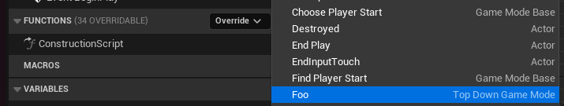

> [Unreal Engine 5 Code Snippets](../README.md) / [C++ Code Snippets For Unreal Engine](README.md) / Override C++ Function in Blueprint.md
## Override C++ Function in Blueprint
// .h
// Class Specifiers: BlueprintType, Blueprintable
UCLASS(BlueprintType, Blueprintable) 
class MYGAME_API AMyGameMode : public AGameModeBase
{
    // decalre function
    UFUNCTION(BlueprintNativeEvent)
    void foo();
}

// .cpp
void AMyGameMode::foo_Implementation()
{
}

// now you can override in blueprint

